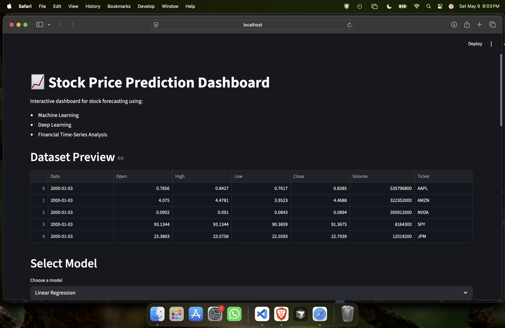
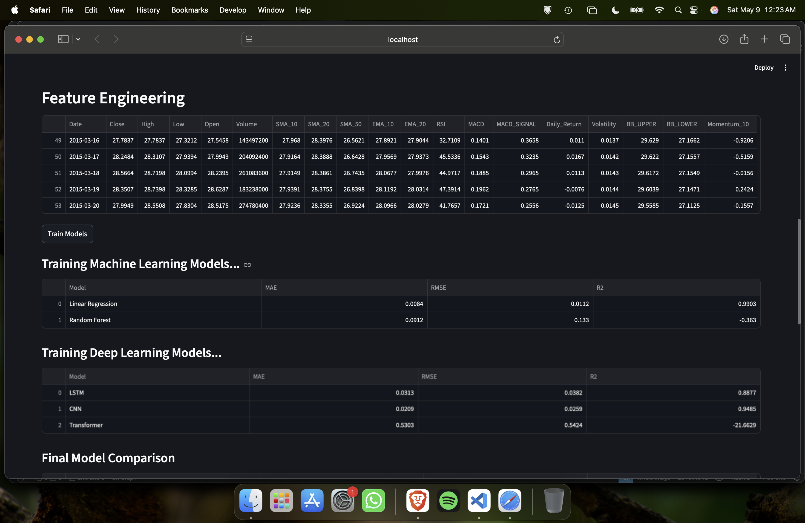
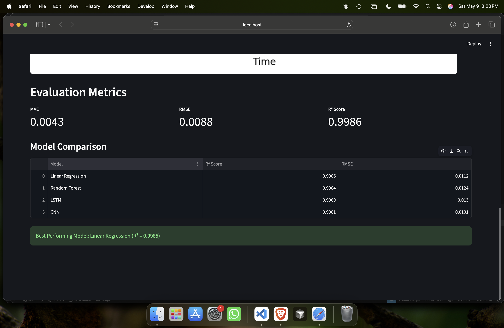
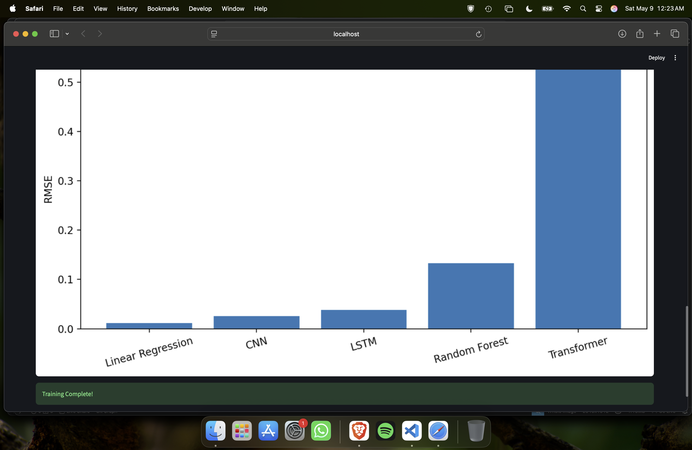

# Stock Price Prediction System

An end-to-end Machine Learning and Deep Learning project for forecasting stock prices using historical financial market data, advanced feature engineering, statistical validation techniques, and interactive visual analytics.

---

# Project Overview

This project predicts stock price movements using multiple predictive models ranging from traditional Machine Learning algorithms to Deep Learning architectures.

The system includes:
- Financial data collection from Yahoo Finance
- Time-series preprocessing pipelines
- Statistical validation tests
- Financial feature engineering
- Machine Learning and Deep Learning model training
- Comparative model evaluation
- Interactive Streamlit dashboard visualization

---

# Features

## Data Collection
- Historical stock market data retrieval using Yahoo Finance API
- Automated CSV dataset generation

## Data Preprocessing
- Missing value handling
- Normalization and scaling
- Sliding window sequence generation
- Time-series train-test splitting

## Feature Engineering
Implemented over 25 financial and statistical indicators including:
- Moving Averages (SMA, EMA)
- MACD
- RSI
- Bollinger Bands
- Volatility
- Daily Returns
- Momentum Indicators

## Statistical Validation
Performed rigorous statistical analysis using:
- Shapiro-Wilk Normality Test
- Augmented Dickey-Fuller (ADF) Test
- KPSS Stationarity Test
- Seasonal Decomposition
- ACF/PACF Analysis

## Machine Learning Models
- Linear Regression
- Random Forest Regressor

## Deep Learning Models
- LSTM
- CNN
- Transformer-inspired Neural Network

## Evaluation Metrics
- MAE (Mean Absolute Error)
- RMSE (Root Mean Squared Error)
- R² Score

## Interactive Dashboard
Built using Streamlit:
- Live stock visualizations
- Feature engineered datasets
- Real-time model training
- Comparative model performance analysis

---

# Project Structure

```text
Stock-Price-Prediction-System/
│
├── app.py
├── main.py
├── requirements.txt
├── README.md
│
├── data/
│   └── stock_data.csv
│
├── models/
│   ├── linear_regression.pkl
│   ├── random_forest.pkl
│   ├── lstm_model.h5
│   ├── cnn_model.h5
│   └── transformer_model.h5
│
├── notebooks/
│
├── reports/
│   ├── model_results.csv
│   └── figures/
│
├── screenshots/
│
├── src/
│   ├── data_collection.py
│   ├── preprocessing.py
│   ├── feature_engineering.py
│   ├── statistical_validation.py
│   ├── train_ml_models.py
│   ├── train_dl_models.py
│   ├── evaluate_models.py
│   ├── visualization.py
│   └── utils.py
│
└── venv/
```

---

# Installation

## Clone Repository

```bash
git clone YOUR_REPOSITORY_URL
cd Stock-Price-Prediction-System
```

---

# Create Virtual Environment

## macOS/Linux

```bash
python3.11 -m venv venv
source venv/bin/activate
```

## Windows

```bash
python -m venv venv
venv\Scripts\activate
```

---

# Install Dependencies

```bash
pip install -r requirements.txt
```

---

# Run Main Pipeline

```bash
python main.py
```

This will:
- preprocess data
- engineer features
- validate statistical assumptions
- train ML and DL models
- generate reports and plots

---

# Run Streamlit Dashboard

```bash
streamlit run app.py
```

---

# Sample Results

| Model | RMSE | R² Score |
|---|---|---|
| Linear Regression | 0.0112 | 0.9903 |
| CNN | 0.0259 | 0.9485 |
| LSTM | 0.0382 | 0.8877 |
| Random Forest | 0.1330 | -0.3630 |
| Transformer | 0.5424 | -21.6629 |

---
# Dashboard Preview

## Main Dashboard



## Feature Engineering



## Model Comparison



## Training Results



# Technologies Used

- Python
- TensorFlow / Keras
- Scikit-learn
- Pandas
- NumPy
- Statsmodels
- Matplotlib
- Seaborn
- Streamlit
- Yahoo Finance API

---

# Future Improvements

- Hyperparameter optimization using Optuna
- Attention-based Transformers
- Multi-stock forecasting
- Real-time market prediction
- Sentiment analysis integration
- Docker deployment
- Cloud deployment (AWS/GCP)

---